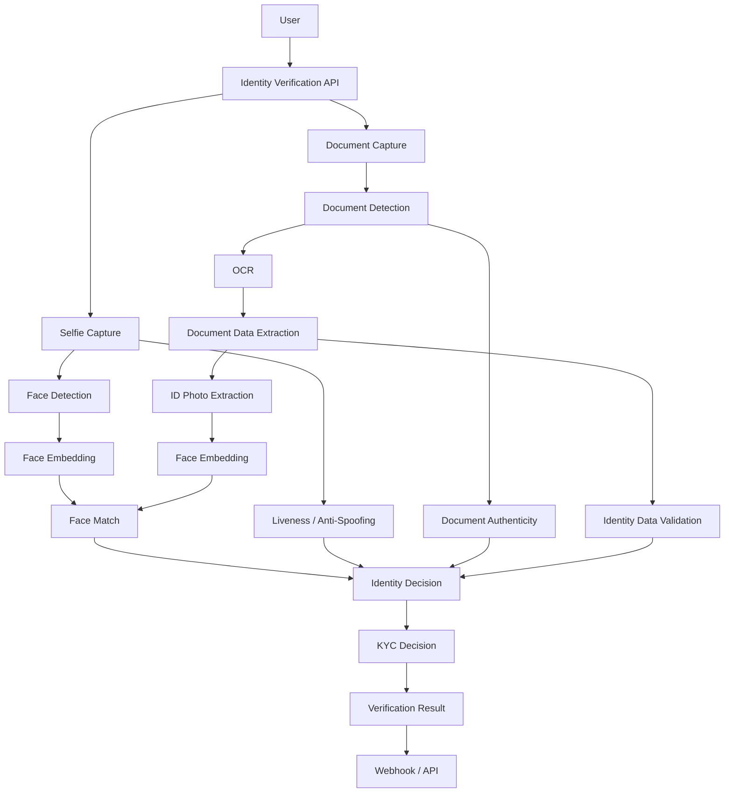

# Awesome-Identity-Verification-API

# 🔐 Top Identity Verification APIs


A curated list of **Identity Verification APIs, KYC/eKYC platforms, document verification systems, biometric verification APIs, and open-source identity-verification projects**.


Identity verification platforms typically combine **government-ID document verification, OCR, document authenticity checks, selfie verification, face matching, liveness detection, biometric verification, AML/KYC workflows, fraud detection, and identity data enrichment**.


> **Open-source software is the primary focus of this list.** There are relatively few fully open-source alternatives that reproduce the complete Persona/Veriff/Jumio/Sumsub experience. The open-source ecosystem is therefore strongest around **face verification, liveness/anti-spoofing, OCR, document parsing, KYC workflows, verifiable credentials, and identity infrastructure**, which can be assembled into a self-hosted verification stack.


## 📑 Table of Contents


* [☁️ SaaS/Hosted Platforms](#️-saashosted-platforms)

* [🌍 Open-Source](#-open-source)

* [🧩 Open-Source Identity Verification Building Blocks](#-open-source-identity-verification-building-blocks)

* [🪪 Open Identity Standards & Protocols](#-open-identity-standards--protocols)

* [🏗️ Building a Self-Hosted Identity Verification Stack](#️-building-a-self-hosted-identity-verification-stack)

* [🔍 Commercial vs Open-Source](#-commercial-vs-open-source)

* [🤝 How to Contribute](#-how-to-contribute)

* [⚠️ Disclaimer](#️-disclaimer)


---


## ☁️ SaaS/Hosted Platforms


| Platform                                                                                                | Description                                                                                                                                                             | Primary Focus                     |

| ------------------------------------------------------------------------------------------------------- | ----------------------------------------------------------------------------------------------------------------------------------------------------------------------- | --------------------------------- |

| [Persona](https://withpersona.com/)                                                                     | Identity infrastructure platform providing identity verification, KYC/KYB, document verification, biometrics, fraud detection, and configurable verification workflows. | Identity Verification, KYC/KYB    |

| [Veriff](https://www.veriff.com/)                                                                       | Global identity-verification platform combining document verification, biometric verification, fraud detection, and automated identity checks.                          | ID Verification, Fraud Prevention |

| [Jumio](https://www.jumio.com/)                                                                         | Enterprise identity-verification platform supporting document verification, biometric verification, liveness, KYC, AML, and fraud prevention.                           | Enterprise KYC, Biometrics        |

| [Onfido](https://www.onfido.com/)                                                                       | Digital identity verification platform providing document verification, biometric face verification, and identity assurance APIs.                                       | ID + Biometric Verification       |

| [Sumsub](https://sumsub.com/)                                                                           | Global verification platform covering KYC, KYB, AML, identity verification, fraud prevention, transaction monitoring, and compliance workflows.                         | KYC/KYB, AML, Fraud               |

| [Trulioo](https://www.trulioo.com/)                                                                     | Global identity verification and business verification platform providing identity data, document verification, KYC/KYB, and AML capabilities.                          | Global Identity Data, KYC/KYB     |

| [Incode](https://incode.com/)                                                                           | AI-powered identity platform offering document verification, biometric verification, liveness detection, fraud prevention, and onboarding.                              | Biometric Identity, KYC           |

| [IDnow](https://www.idnow.io/)                                                                          | European identity platform providing automated and expert-assisted identity verification, eID, document verification, AML, and fraud prevention.                        | European Identity, KYC            |

| [AU10TIX](https://www.au10tix.com/)                                                                     | Identity verification and fraud-prevention platform focused on automated document authentication, identity verification, and risk intelligence.                         | ID Verification, Fraud            |

| [Socure](https://www.socure.com/)                                                                       | Digital identity verification and fraud-prevention platform using identity intelligence, document verification, biometric signals, and risk scoring.                    | Digital Identity, Fraud           |

| [Stripe Identity](https://stripe.com/identity)                                                          | Identity-verification product integrated with Stripe for document and biometric verification and identity checks.                                                       | Payments, KYC                     |

| [Plaid Identity Verification](https://plaid.com/products/identity-verification/)                        | Identity-verification infrastructure combining document, database, and biometric signals for onboarding and fraud prevention.                                           | Fintech, KYC                      |

| [DigiLocker](https://www.digilocker.gov.in/)                                                            | India's digital document platform enabling users to access and share digitally issued identity and government documents.                                                | Digital Documents, India          |

| [ID-Pal](https://www.id-pal.com/)                                                                       | Digital identity verification platform supporting document verification, facial recognition, AML screening, and business verification.                                  | KYC/KYB                           |

| [Veridas](https://veridas.com/)                                                                         | Biometric identity platform focused on face and voice biometrics, document verification, and identity assurance.                                                        | Biometrics                        |

| [Facephi](https://facephi.com/)                                                                         | Digital identity and biometric onboarding platform with facial recognition, liveness, and identity verification capabilities.                                           | Digital Identity, Biometrics      |

| [Mitek](https://www.miteksystems.com/)                                                                  | Digital identity and document-verification technology supporting mobile capture, ID verification, and fraud prevention.                                                 | ID Document Verification          |

| [GBG](https://www.gbgplc.com/)                                                                          | Identity intelligence and verification platform supporting digital onboarding, identity data, fraud prevention, and compliance.                                         | Identity Intelligence             |

| [LexisNexis Risk Solutions](https://risk.lexisnexis.com/)                                               | Identity and fraud-risk infrastructure combining identity intelligence, verification, authentication, and risk analytics.                                               | Identity Intelligence, Fraud      |

| [Experian Identity Verification](https://www.experian.com/business/products/identity-verification.html) | Identity verification and fraud-prevention services based on identity data and risk signals.                                                                            | Identity Verification, Fraud      |

| [Ekata](https://ekata.com/)                                                                             | Identity intelligence platform providing global identity data and risk signals for digital onboarding and fraud prevention.                                             | Identity Intelligence             |

| [Footprint](https://www.footprint.com/)                                                                 | Digital identity and KYC infrastructure for account creation, identity verification, fraud prevention, and authentication.                                              | Digital Identity, KYC             |


---


## 🌍 Open-Source


> ⭐ **This is the primary section of this repository.**

>

> Fully open-source replacements for Persona, Veriff, Jumio, or Sumsub are still relatively uncommon. However, several projects provide substantial parts of the underlying technology required to construct a self-hosted identity-verification API.


| Project                                                                                     | Description                                                                                                                                                                                                                                                         | Best Use                                 |

| ------------------------------------------------------------------------------------------- | ------------------------------------------------------------------------------------------------------------------------------------------------------------------------------------------------------------------------------------------------------------------- | ---------------------------------------- |

| [FaceOnLive ID-Verification-OpenKYC](https://github.com/FaceOnLive/ID-Verification-OpenKYC) | OpenKYC community project combining face recognition, face liveness/anti-spoofing, ID document recognition, and identity-verification functionality.                                                                                                                | ⭐ Full KYC Prototype                     |

| [CompreFace](https://github.com/exadel-inc/CompreFace)                                      | Apache-2.0 open-source face-recognition service with REST APIs for face recognition, face verification, face detection, landmarks, head pose, and related capabilities.                                                                                             | ⭐ Face Verification API                  |

| [OpenKYC](https://openkyc.org/open-source)                                                  | Open identity-verification infrastructure project centered on wallets, issuer/verifier SDKs, verifiable credentials, OpenID4VC/VP, and self-hosted identity infrastructure. Its repositories are planned to be released under Apache 2.0 but are currently private. | ⭐ Open Identity / KYC Infrastructure     |

| [InsightFace](https://github.com/deepinsight/insightface)                                   | Open-source face-analysis and recognition toolkit containing modern face-recognition, detection, alignment, and embedding models.                                                                                                                                   | ⭐ Face Recognition                       |

| [DeepFace](https://github.com/serengil/deepface)                                            | Open-source Python framework wrapping multiple face-recognition and facial-analysis models with APIs for verification, recognition, and analysis.                                                                                                                   | Face Verification                        |

| [face_recognition](https://github.com/ageitgey/face_recognition)                            | Python face-recognition library built on dlib, providing simple face encoding and face-comparison APIs.                                                                                                                                                             | Face Matching                            |

| [DeepFaceLab](https://github.com/iperov/DeepFaceLab)                                        | Open-source face-processing/deep-learning framework with extensive face extraction and recognition-related tooling.                                                                                                                                                 | Computer Vision Research                 |

| [PaddleOCR](https://github.com/PaddlePaddle/PaddleOCR)                                      | Open-source OCR toolkit supporting document text detection, recognition, layout analysis, and multilingual document processing.                                                                                                                                     | ⭐ ID OCR                                 |

| [docTR](https://github.com/mindee/doctr)                                                    | Open-source deep-learning library for optical character recognition and document text extraction.                                                                                                                                                                   | OCR / Document Processing                |

| [EasyOCR](https://github.com/JaidedAI/EasyOCR)                                              | Open-source OCR library supporting many languages and document/image text extraction.                                                                                                                                                                               | OCR                                      |

| [Tesseract OCR](https://github.com/tesseract-ocr/tesseract)                                 | Open-source OCR engine widely used for extracting text from identity documents and scanned images.                                                                                                                                                                  | OCR Infrastructure                       |

| [OpenCV](https://github.com/opencv/opencv)                                                  | Open-source computer-vision library useful for image processing, document detection, cropping, quality assessment, and preprocessing.                                                                                                                               | Computer Vision                          |

| [MediaPipe](https://github.com/google-ai-edge/mediapipe)                                    | Open-source framework providing face detection, landmarks, tracking, and other perception capabilities.                                                                                                                                                             | Face Detection / Liveness Building Block |

| [OpenMMLab](https://github.com/open-mmlab)                                                  | Collection of open-source computer-vision frameworks covering detection, recognition, segmentation, and related tasks.                                                                                                                                              | Computer Vision                          |

| [PaddleDetection](https://github.com/PaddlePaddle/PaddleDetection)                          | Open-source object-detection toolkit useful for detecting document boundaries and visual features.                                                                                                                                                                  | Document Detection                       |

| [Ultralytics](https://github.com/ultralytics/ultralytics)                                   | Open-source computer-vision framework supporting object detection and other vision workloads.                                                                                                                                                                       | Document / Face Detection                |

| [Veramo](https://github.com/decentralized-identity/veramo)                                  | Open-source framework for decentralized identity and verifiable credentials.                                                                                                                                                                                        | ⭐ Decentralized Identity                 |

| [OpenWallet Foundation](https://github.com/openwallet-foundation)                           | Open-source ecosystem for digital wallets and interoperable identity credentials.                                                                                                                                                                                   | Digital Identity                         |

| [SpruceID](https://github.com/spruceid)                                                     | Open-source decentralized identity and verifiable-credential ecosystem.                                                                                                                                                                                             | Verifiable Credentials                   |

| [Credo](https://github.com/openwallet-foundation/credo-ts)                                  | TypeScript framework for building decentralized identity and verifiable-credential applications.                                                                                                                                                                    | DID / Credentials                        |

| [Keycloak](https://github.com/keycloak/keycloak)                                            | Open-source identity and access-management system supporting authentication, identity federation, and authorization.                                                                                                                                                | Authentication                           |

| [Authentik](https://github.com/goauthentik/authentik)                                       | Open-source identity provider and authentication platform.                                                                                                                                                                                                          | Identity Infrastructure                  |

| [ZITADEL](https://github.com/zitadel/zitadel)                                               | Open-source identity and access-management platform supporting authentication and user identity infrastructure.                                                                                                                                                     | IAM                                      |

| [Authentik](https://github.com/goauthentik/authentik)                                       | Self-hosted identity provider with modern authentication and identity-management capabilities.                                                                                                                                                                      | IAM                                      |

| [privacyIDEA](https://github.com/privacyidea/privacyidea)                                   | Open-source authentication and multi-factor authentication platform.                                                                                                                                                                                                | Identity Authentication                  |


---


## 🧩 Open-Source Identity Verification Building Blocks


A complete KYC/identity-verification system is normally composed of several independent technologies.


### 🪪 ID Document OCR


* [PaddleOCR](https://github.com/PaddlePaddle/PaddleOCR)

* [docTR](https://github.com/mindee/doctr)

* [EasyOCR](https://github.com/JaidedAI/EasyOCR)

* [Tesseract](https://github.com/tesseract-ocr/tesseract)

* [OpenCV](https://github.com/opencv/opencv)


Useful for extracting:


* Name

* Date of birth

* Document number

* Expiration date

* Nationality

* Address

* Machine-readable zones

* PDF417 / barcode information

* Document metadata


---


### 👤 Face Recognition & Face Matching


* [CompreFace](https://github.com/exadel-inc/CompreFace)

* [InsightFace](https://github.com/deepinsight/insightface)

* [DeepFace](https://github.com/serengil/deepface)

* [face_recognition](https://github.com/ageitgey/face_recognition)

* [OpenCV](https://github.com/opencv/opencv)

* [MediaPipe](https://github.com/google-ai-edge/mediapipe)


These can provide the core technology for:


```text

Government ID Photo

        ↓

Face Detection

        ↓

Face Embedding

        ↓

Selfie Face Embedding

        ↓

Similarity / Match Score

        ↓

Identity Match

```


---


### 🛡️ Liveness & Anti-Spoofing


Liveness detection is one of the most difficult components to reproduce in an open-source stack.


Potential building blocks include:


* [InsightFace](https://github.com/deepinsight/insightface)

* [OpenCV](https://github.com/opencv/opencv)

* [MediaPipe](https://github.com/google-ai-edge/mediapipe)

* [DeepFace](https://github.com/serengil/deepface)

* [FaceOnLive OpenKYC](https://github.com/FaceOnLive/ID-Verification-OpenKYC)


A production-grade implementation may additionally require:


* Presentation-attack detection

* Replay detection

* Screen detection

* Printed-photo detection

* 3D mask detection

* Deepfake detection

* Camera integrity checks

* Device-risk signals


---


### 📄 Document Authenticity


A real identity-verification system requires substantially more than OCR.


A document verification pipeline can include:


```text

Image Capture

     ↓

Document Detection

     ↓

Image Quality

     ↓

OCR

     ↓

MRZ / Barcode Extraction

     ↓

Document Classification

     ↓

Security Feature Analysis

     ↓

Tampering Detection

     ↓

Data Consistency Checks

     ↓

Identity Verification

```


Useful open-source building blocks:


* [OpenCV](https://github.com/opencv/opencv)

* [PaddleOCR](https://github.com/PaddlePaddle/PaddleOCR)

* [docTR](https://github.com/mindee/doctr)

* [Tesseract](https://github.com/tesseract-ocr/tesseract)

* [PaddleDetection](https://github.com/PaddlePaddle/PaddleDetection)


---


## 🪪 Open Identity Standards & Protocols


Identity verification is increasingly moving beyond one-time KYC checks toward **portable, reusable digital credentials**.


### W3C Verifiable Credentials


[W3C Verifiable Credentials](https://www.w3.org/TR/vc-data-model/) define a standardized model for representing digitally verifiable claims.


### OpenID4VC


[OpenID for Verifiable Credentials](https://openid.net/sg/openid4vc/) provides protocols for issuing and presenting verifiable credentials.


### Decentralized Identifiers


[DIDs](https://www.w3.org/TR/did-core/) provide a standardized framework for decentralized identifiers.


### OpenID Connect


[OpenID Connect](https://openid.net/connect/) provides an identity layer on top of OAuth 2.0.


### Digital Identity Wallets


The emerging wallet ecosystem enables:


```text

KYC Provider

     ↓

Verified Credential

     ↓

User Wallet

     ↓

Selective Disclosure

     ↓

Multiple Services

```


This can potentially reduce repeated KYC checks while allowing users to selectively disclose only the information required by a relying party.


---


## 🏗️ Building a Self-Hosted Identity Verification Stack


A fully self-hosted alternative to Persona/Veriff/Jumio/Sumsub can be assembled from multiple open-source components.





### Example Open-Source Stack


```text

API Layer

   │

   ├── FastAPI / Node.js

   │

   ├── PaddleOCR / docTR

   │

   ├── OpenCV

   │

   ├── CompreFace

   │

   ├── InsightFace

   │

   ├── MediaPipe

   │

   ├── PostgreSQL

   │

   ├── Redis

   │

   └── Keycloak

```


Potential architecture:


```text

                    ┌────────────────────┐

                    │ Identity API       │

                    │ FastAPI / Node.js  │

                    └─────────┬──────────┘

                              │

          ┌───────────────────┼───────────────────┐

          │                   │                   │

          ▼                   ▼                   ▼

    Document OCR        Face Verification    Liveness

    PaddleOCR           CompreFace            CV Models

    docTR               InsightFace           Anti-Spoof

          │                   │                   │

          └───────────────────┼───────────────────┘

                              ▼

                    ┌────────────────────┐

                    │ Verification       │

                    │ Decision Engine    │

                    └─────────┬──────────┘

                              │

              ┌───────────────┼───────────────┐

              ▼               ▼               ▼

          KYC Result       Risk Score       Webhook

```


---


## 🔍 Commercial vs Open-Source


| Capability                       | Commercial Identity API |     Open-Source Stack |

| -------------------------------- | ----------------------: | --------------------: |

| ID Document OCR                  |                       ✅ |                     ✅ |

| Face Matching                    |                       ✅ |                     ✅ |

| Face Detection                   |                       ✅ |                     ✅ |

| Liveness Detection               |                       ✅ |                    ⚠️ |

| Document Authenticity            |                       ✅ |                    ⚠️ |

| Global ID Coverage               |                     ⭐⭐⭐ |                    ⚠️ |

| Government Database Checks       |                       ✅ | ❌ / External Provider |

| KYC Screening                    |                       ✅ |                    ⚠️ |

| AML Screening                    |                       ✅ | ❌ / External Provider |

| Sanctions Screening              |                       ✅ | ❌ / External Provider |

| PEP Screening                    |                       ✅ | ❌ / External Provider |

| Fraud Intelligence               |                     ⭐⭐⭐ |                    ⚠️ |

| Device Intelligence              |                       ✅ |                    ⚠️ |

| Deepfake Detection               |                       ✅ |                    ⚠️ |

| Webhooks                         |                       ✅ |                     ✅ |

| REST APIs                        |                       ✅ |                     ✅ |

| Self-Hosting                     |               Sometimes |                     ⭐ |

| Source Code Access               |                       ❌ |                     ⭐ |

| Data Residency Control           |                  Varies |                   ⭐⭐⭐ |

| Vendor Lock-in                   |                  Higher |                 Lower |

| Global Compliance Infrastructure |                     ⭐⭐⭐ |                   DIY |


---


## ⭐ Recommended Open-Source Projects to Explore First


If the goal is specifically to build an **open-source alternative to Persona, Veriff, Jumio, Onfido, or Sumsub**, start with:


1. **[CompreFace](https://github.com/exadel-inc/CompreFace)** — ⭐ strongest general-purpose open-source face-verification API.

2. **[FaceOnLive ID-Verification-OpenKYC](https://github.com/FaceOnLive/ID-Verification-OpenKYC)** — ⭐ closest among the listed projects to a complete open KYC/identity-verification stack.

3. **[InsightFace](https://github.com/deepinsight/insightface)** — powerful face-analysis and recognition foundation.

4. **[PaddleOCR](https://github.com/PaddlePaddle/PaddleOCR)** — excellent foundation for ID-document OCR.

5. **[docTR](https://github.com/mindee/doctr)** — modern open-source document OCR.

6. **[DeepFace](https://github.com/serengil/deepface)** — convenient face-verification framework.

7. **[OpenCV](https://github.com/opencv/opencv)** — fundamental computer-vision infrastructure.

8. **[MediaPipe](https://github.com/google-ai-edge/mediapipe)** — useful for face detection, landmarks, tracking, and perception.

9. **[Veramo](https://github.com/decentralized-identity/veramo)** — decentralized identity and verifiable-credential infrastructure.

10. **[Credo](https://github.com/openwallet-foundation/credo-ts)** — TypeScript framework for decentralized identity applications.

11. **[SpruceID](https://github.com/spruceid)** — open-source decentralized identity ecosystem.

12. **[Keycloak](https://github.com/keycloak/keycloak)** — authentication and identity-management infrastructure.


---


## 🚧 The Biggest Open-Source Gaps


The open-source ecosystem is relatively strong for **computer vision and identity plumbing**, but considerably weaker for the parts that make commercial identity-verification APIs difficult to reproduce.


The largest gaps include:


* 🌎 Global government-ID coverage

* 🪪 Document template databases

* 🔐 Document security-feature verification

* 🛡️ Production-grade liveness detection

* 🤖 Deepfake detection

* 📱 Device intelligence

* 🌐 IP intelligence

* 🏦 Bank-account ownership verification

* 🧑‍⚖️ KYC regulatory workflows

* 🚨 AML screening

* 🕵️ Sanctions screening

* 👤 PEP screening

* 🏢 KYB / business verification

* 📊 Fraud consortium intelligence

* 🌍 Country-specific identity databases

* 📜 Regulatory certifications

* 🧪 Large-scale biometric evaluation

* 🔒 Privacy-preserving biometric storage


This is why a realistic open-source competitor to Persona or Veriff is usually **an ecosystem of components rather than one GitHub repository**.


---


## 🤝 How to Contribute


Contributions are welcome! Please help expand this list with:


* Open-source identity-verification APIs

* Open-source KYC platforms

* Open-source eKYC systems

* Face-verification APIs

* Face-liveness systems

* Anti-spoofing models

* ID-document OCR systems

* ID-document classification systems

* Document-authentication projects

* MRZ/barcode readers

* Biometric identity systems

* Open-source AML/KYC engines

* Open-source sanctions-screening systems

* Open-source PEP databases

* Verifiable-credential implementations

* DID implementations

* Digital identity wallets

* Open identity protocols

* Self-hosted identity infrastructure


### Contribution Guidelines


1. Fork this repository.

2. Add the project to the appropriate section.

3. Prefer projects with an active repository and a clearly stated license.

4. Clearly distinguish **fully open-source software**, **open-core software**, **research projects**, **datasets**, and **open standards**.

5. Do not classify commercial APIs as open-source merely because they provide a free tier.

6. Submit a pull request.


---


## ⚠️ Disclaimer


This repository is a **curated software directory**, not legal, financial, compliance, or security advice.


Identity verification is a highly sensitive domain. Before deploying an open-source identity-verification stack in production, organizations should independently evaluate:


* Privacy requirements

* Biometric-data regulations

* Data retention

* Data residency

* Consent requirements

* Encryption

* Access controls

* Audit logging

* Bias and demographic performance

* False acceptance rates

* False rejection rates

* Presentation-attack resistance

* Identity-document coverage

* KYC/AML obligations

* Local regulatory requirements


An open-source face-recognition or OCR project should **not automatically be considered equivalent to a regulated commercial KYC/identity-verification service**.


Also note that some open-source projects may have licenses, model restrictions, dataset restrictions, or third-party dependencies that affect commercial use.


**Last updated: August 2026**
