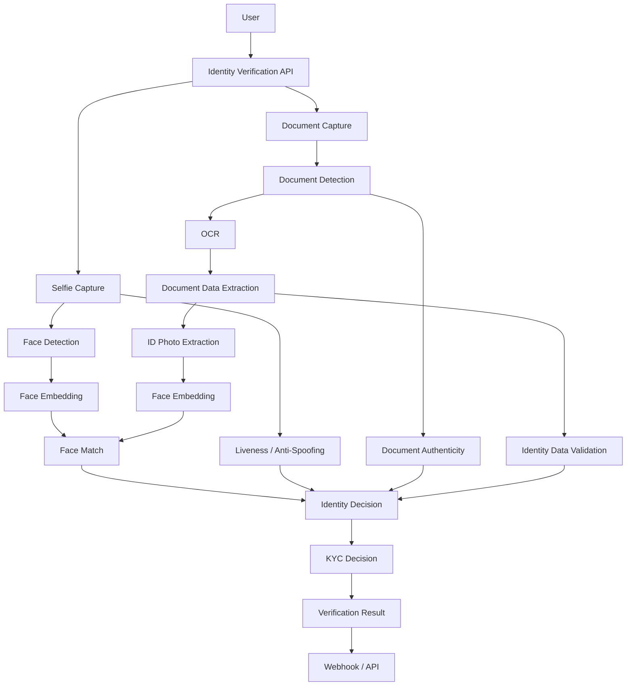

# 🔐 Awesome Identity Verification API: The Ultimate Guide to KYC, Biometrics, Document OCR & Decentralized Identity

<p align="center">
  <a href="https://github.com/ishandutta2007/Awesome-Identity-Verification-API">
    
  </a>
</p>

<p align="center">
  <a href="https://github.com/ishandutta2007/Awesome-Awesome-Awesome"></a><a href="https://discord.gg/jc4xtF58Ve"></a>
  <a href="https://github.com/ishandutta2007/Awesome-Identity-Verification-API/stargazers"></a>
  <a href="https://github.com/ishandutta2007/Awesome-Identity-Verification-API/network/members"></a>
  <a href="https://github.com/ishandutta2007/Awesome-Identity-Verification-API/blob/main/LICENSE"></a>
  <a href="https://github.com/ishandutta2007/Awesome-Identity-Verification-API/pulls"></a>
  <a href="https://github.com/ishandutta2007"></a>
</p>

---

A comprehensive, curated directory of **Identity Verification APIs, KYC/eKYC platforms, document verification systems, biometric facial recognition APIs, anti-spoofing / liveness detection models, verifiable credentials, and self-hosted identity verification stacks**.

Identity verification platforms combine **government ID document verification, optical character recognition (OCR), document authenticity checks, selfie verification, 2D/3D face matching, liveness / presentation-attack detection (PAD), AML/PEP screening, synthetic fraud prevention, and identity data enrichment**.

> 💡 **Open-source software is the primary focus of this list.** While fully open-source drop-in replacements for Persona, Veriff, Jumio, or Sumsub are rare, the open-source ecosystem provides robust building blocks for **face recognition, liveness/anti-spoofing, ID OCR, MRZ barcode extraction, KYC workflows, verifiable credentials (W3C DID/VC), and IAM infrastructure** to construct a modern self-hosted verification stack.

---

## 📑 Table of Contents

* [☁️ SaaS & Hosted Platforms](#️-saas--hosted-platforms)
* [🌍 Open-Source Repositories (Ranked by Stars)](#-open-source-repositories-ranked-by-stars)
* [🧩 Open-Source Identity Verification Building Blocks](#-open-source-identity-verification-building-blocks)
  * [🪪 ID Document OCR & Barcode Extraction](#-id-document-ocr--barcode-extraction)
  * [👤 Face Recognition & Biometric Matching](#-face-recognition--biometric-matching)
  * [🛡️ Liveness Detection & Anti-Spoofing (PAD)](#️-liveness-detection--anti-spoofing-pad)
  * [📄 Document Authenticity & Security Analysis](#-document-authenticity--security-analysis)
  * [🔑 Identity & Access Management (IAM / Auth)](#-identity--access-management-iam--auth)
* [🪪 Open Identity Standards & Protocols (DID / VC)](#-open-identity-standards--protocols-did--vc)
* [🏗️ Building a Self-Hosted Identity Verification Stack](#️-building-a-self-hosted-identity-verification-stack)
* [🔍 Commercial SaaS vs Open-Source Comparison](#-commercial-saas-vs-open-source-comparison)
* [⭐ Recommended Open-Source Projects to Explore First](#-recommended-open-source-projects-to-explore-first)
* [🚧 Key Industry & Open-Source Challenges](#-key-industry--open-source-challenges)
* [📈 Star History](#-star-history)
* [🤝 How to Contribute](#-how-to-contribute)
* [⚠️ Disclaimer & Compliance Notes](#️-disclaimer--compliance-notes)

---

## ☁️ SaaS & Hosted Platforms

> 📊 **Market Size & Structure Analysis (2024–2032):** The global Identity Verification (IDV) market is estimated at **$12.5+ Billion in 2025–2026** and projected to exceed **$30+ Billion by 2032** (~15.4% CAGR). The sector is **moderately-to-highly fragmented** (not a winner-take-all market) due to distinct sovereign regulatory mandates, regional government ID template variations, local AML/PEP database exclusivity, and specialized vertical requirements across banking, fintech, crypto, e-commerce, healthcare, and the gig economy.

*The table below is sorted descending by company scale (market valuation / parent revenue).*

| Platform | Valuation / Company Scale | Description | Primary Focus | Pricing | Free Tier / Trial Limits |
| :--- | :--- | :--- | :--- | :--- | :--- |
| [Stripe Identity](https://stripe.com/identity) | **$159 Billion** Valuation | Identity-verification product integrated with Stripe for document and biometric verification and fraud checks. | Payments, KYC | $1.50 per document + selfie check ($0.50 per ID number check), pay-as-you-go | First 50 live verifications free (one-time allowance); unlimited free Stripe Test Mode sandbox |
| [LexisNexis Risk Solutions](https://risk.lexisnexis.com/) | **$85 Billion** Parent (RELX) Cap / $3.5B+ Rev | Enterprise identity and fraud-risk infrastructure combining identity intelligence, ThreatMetrix, and InstantID analytics. | Identity Intelligence, Fraud | Starts at ~$0.50–$2.50 per transaction / InstantID check (~$5,000–$20,000/yr commit) | 7 to 30-day proof-of-concept (POC) trial upon sales negotiation |
| [Experian Identity](https://www.experian.com/business/products/identity-verification.html) | **~$35 Billion** Market Cap / $7.1B Rev | Identity verification and fraud-prevention services based on credit bureau signals and CrossCore orchestration. | Identity Verification, Fraud | Starts at ~$0.50–$2.00 per verification check for CrossCore/Precise ID (consumer IdentityWorks from $9.99/mo) | 14-day free trial / test credits for data quality APIs; 7-day free trial for consumer IdentityWorks |
| [Plaid Identity Verification](https://plaid.com/products/identity-verification/) | **$8.0 Billion** Valuation / ~$540M ARR | Identity-verification infrastructure combining document, database, and biometric signals for frictionless onboarding. | Fintech, KYC | Starts at ~$1.00–$2.00 per verification (tiered volume rates) | Free unlimited sandbox testing using simulated test identities |
| [Socure](https://www.socure.com/) | **$5.2 Billion** Valuation / $364M ARR | Digital identity verification and fraud-prevention platform using identity intelligence, DocV, and predictive ML scoring. | Digital Identity, Fraud | Starts at ~$0.50–$2.00 per evaluation (Socure Launch offers $1,000/mo startup credits) | Free developer sandbox (up to 1,000 test requests/day) + $1,000/mo credits for startups via Socure Launch |
| [Trulioo](https://www.trulioo.com/) | **$1.8 Billion** Valuation / ~$150M ARR | Global identity verification and business verification platform providing identity data, document verification, and KYC/KYB. | Global Identity Data, KYC/KYB | Starts at $99/mo platform base fee (~$1.00–$3.00/verification based on volume) | Developer sandbox access with mock test entities upon sales onboarding |
| [Persona](https://withpersona.com/) | **$1.5 Billion** Valuation (Series C) | Configurable identity infrastructure platform providing KYC/KYB, document verification, biometrics, and automated workflows. | Identity Verification, KYC/KYB | Starts at $250/mo (Essential Plan, ~$1.50/verification) | 60-day free trial (up to 50 live verifications; unlimited sandbox) or 500 free verifications/mo for 1 yr via Startup Program |
| [Veriff](https://www.veriff.com/) | **$1.5 Billion** Valuation (Series C) | Global identity-verification platform combining AI document verification, biometric facial recognition, and automated checks. | ID Verification, Fraud Prevention | Starts at $49/mo minimum commitment (~$0.80/verification for Essential; $99/mo for Plus at ~$1.39/verification) | 15-day free trial with up to 50 live verification sessions (no credit card required) |
| [Incode](https://incode.com/) | **$1.25 Billion** Valuation (Unicorn) | AI-first identity platform offering automated document verification, biometric verification, passive liveness, and onboarding. | Biometric Identity, KYC | Starts at ~$1.50–$3.00/verification (~$12,000/yr enterprise commit) | Evaluation POC & sandbox trial upon sales request |
| [Jumio](https://www.jumio.com/) | **~$1.2 Billion** Valuation / ~$180M Rev | Enterprise identity-verification platform supporting document verification, biometric verification, liveness, KYC, and AML. | Enterprise KYC, Biometrics | Starts at ~$1.00–$2.50/verification ($10,000–$50,000/yr enterprise commit) | 30-day developer sandbox access & evaluation POC upon sales request |
| [GBG](https://www.gbgplc.com/) | **~$1.0 Billion** Market Cap (£750M) | Global identity intelligence and verification platform supporting ID3global, digital onboarding, and fraud compliance. | Identity Intelligence | Starts at ~£1,000/yr platform base fee + ~£0.50–£2.00 per verification check | Free pilot/sandbox test environment with mock data upon sales registration |
| [Ekata](https://ekata.com/) | **$850 Million** (Acquired by Mastercard) | Identity intelligence platform providing global identity data, graph risk signals, and Proximity APIs for fraud detection. | Identity Intelligence | Starts at $200/mo for Pro Insight / Identity Check API packages (~$0.10–$0.50/query) | Free developer sandbox access with mock data via Mastercard Developers portal |
| [Onfido](https://www.onfido.com/) | **~$500 Million** (Acquired by Entrust) | Digital identity verification platform providing document verification, biometric face verification, and workflow automation. | ID + Biometric Verification | Starts at ~$1.20–$2.50/verification (~$5,000/yr enterprise commit) | Free developer sandbox & guided product tour/POC upon sales approval |
| [Mitek Systems](https://www.miteksystems.com/) | **~$450 Million** Market Cap (NASDAQ: MITK) | Digital identity and document-verification technology supporting mobile check deposit, Mobile Verify, and ID capture. | ID Document Verification | Starts at ~$1.00–$2.50 per verification (~$10,000–$25,000/yr enterprise commit) | Interactive walkthrough & sales-assisted sandbox POC upon demo request |
| [AU10TIX](https://www.au10tix.com/) | **~$350 Million** Valuation (TPG backed) | Identity verification and fraud-prevention platform focused on automated document authentication and risk intelligence. | ID Verification, Fraud | Starts at $500/mo minimum commitment (~$1.00–$2.50/verification) | Free demo environment & compliance risk assessment tools upon sales request |
| [Sumsub](https://sumsub.com/) | **~$300 Million** Valuation / ~$50M+ ARR | All-in-one verification platform covering KYC, KYB, AML screening, transaction monitoring, and fraud prevention. | KYC/KYB, AML, Fraud | Starts at $149/mo minimum commitment ($1.35/verification for Basic; $299/mo min at $1.85/verification for Compliance) | 14-day free trial with 50 free verifications |
| [IDnow](https://www.idnow.io/) | **~$250 Million** Valuation | European identity platform providing automated AutoIdent, VideoIdent, eID, document verification, and AML compliance. | European Identity, KYC | Starts at ~€1.20–€3.50/verification (~€5.00–€10.00+ for VideoIdent) | Free developer test sandbox upon partner onboarding (free for end users) |
| [Veridas](https://veridas.com/) | **~$100 Million** Valuation (BBVA JV) | Biometric identity platform focused on modular face and voice biometrics, document verification, and NIST-tested algorithms. | Biometrics | Starts at ~$0.80–$2.00 per verification (pay-as-you-go available on AWS Marketplace) | Free product demo & partner sandbox access upon request |
| [Footprint](https://www.footprint.com/) | **~$80–$100 Million** Valuation | Developer-first identity verification and secure PII vaulting infrastructure for frictionless KYC/KYB onboarding. | Digital Identity, KYC | Starts at ~$1.00–$2.00 per verification check (pay-as-you-go) | Free developer sandbox with unlimited mock verifications and risk evaluations |
| [Facephi](https://facephi.com/) | **~$82 Million** Market Cap (BME: FACE) | Digital identity and biometric onboarding platform with multi-modal facial recognition, liveness, and digital onboarding. | Digital Identity, Biometrics | Starts at ~$1.00–$3.00 per verification (~$10,000/yr enterprise commit) | Free custom demo & proof-of-concept (POC) sandbox upon sales consultation |
| [ID-Pal](https://www.id-pal.com/) | **~$50 Million** Valuation (Series A) | Turnkey digital identity verification platform supporting document capture, facial recognition, and AML screening. | KYC/KYB | Starts at ~$299/mo (includes base monthly check bundle; ~$1.50–$3.00/check additional) | Guided product demo & sandbox evaluation upon sales request |
| [DigiLocker](https://www.digilocker.gov.in/) | **Government Public Infrastructure** | India's national digital credential platform allowing 300M+ citizens to access and share 6B+ government-verified documents. | Digital Documents, India | 100% Free (₹0) for citizens & government requestors via API Setu (~₹1–₹5/txn via 3rd-party aggregators) | Free forever for all citizens (up to 1 GB cloud storage) & free API calls via API Setu |


---


## 🌍 Open-Source Repositories (Ranked by Stars)

> ⭐ **The open-source ecosystem provides building blocks for document OCR, face matching, liveness detection, and identity infrastructure.**

*The table below is sorted descending by GitHub star count.*

| Repository | GitHub_Stars_Badge | Description | Category / Best Use |
| :--- | :--- | :--- | :--- |
| [opencv/opencv](https://github.com/opencv/opencv) | [](https://github.com/opencv/opencv/stargazers) | Open-source computer-vision library essential for image preprocessing, document perspective transform, cropping, and quality filtering. | 🖼️ Computer Vision Core |
| [PaddlePaddle/PaddleOCR](https://github.com/PaddlePaddle/PaddleOCR) | [](https://github.com/PaddlePaddle/PaddleOCR/stargazers) | Modern OCR toolkit supporting multilingual text detection, recognition, layout analysis, and document parsing across 100+ languages. | ⭐ ID Document OCR |
| [tesseract-ocr/tesseract](https://github.com/tesseract-ocr/tesseract) | [](https://github.com/tesseract-ocr/tesseract/stargazers) | The industry-standard open-source OCR engine widely used for extracting alphanumeric characters from identity documents. | 📄 Document Text Extraction |
| [ultralytics/ultralytics](https://github.com/ultralytics/ultralytics) | [](https://github.com/ultralytics/ultralytics/stargazers) | Real-time object detection and instance segmentation framework for detecting ID card boundaries, face crops, and barcodes. | 🎯 ID & Face Detection |
| [ageitgey/face_recognition](https://github.com/ageitgey/face_recognition) | [](https://github.com/ageitgey/face_recognition/stargazers) | Simple Python facial recognition API built on dlib with deep learning models for face encoding and matching. | 👤 Face Matching API |
| [naptha/tesseract.js](https://github.com/naptha/tesseract.js) | [](https://github.com/naptha/tesseract.js/stargazers) | Pure JavaScript port of Tesseract OCR allowing client-side in-browser ID document text extraction without server uploads. | 🌐 In-Browser OCR |
| [google-ai-edge/mediapipe](https://github.com/google-ai-edge/mediapipe) | [](https://github.com/google-ai-edge/mediapipe/stargazers) | Real-time cross-platform ML framework by Google for 468-point 3D face mesh, landmark tracking, and active liveness verification. | 👁️ Face Mesh & Liveness |
| [keycloak/keycloak](https://github.com/keycloak/keycloak) | [](https://github.com/keycloak/keycloak/stargazers) | Open-source enterprise identity and access management (IAM) server supporting OpenID Connect, OAuth 2.0, and SAML 2.0. | 🔑 Identity & Auth Server |
| [zxing/zxing](https://github.com/zxing/zxing) | [](https://github.com/zxing/zxing/stargazers) | Multi-format barcode image processing library supporting PDF417 driver licenses, QR codes, and MRZ data formats. | 🪪 Barcode & PDF417 Parser |
| [open-mmlab/mmdetection](https://github.com/open-mmlab/mmdetection) | [](https://github.com/open-mmlab/mmdetection/stargazers) | Deep learning object detection toolbox providing state-of-the-art architectures for document layout and security feature detection. | 🔍 Document Layout Analysis |
| [JaidedAI/EasyOCR](https://github.com/JaidedAI/EasyOCR) | [](https://github.com/JaidedAI/EasyOCR/stargazers) | PyTorch-based ready-to-use OCR library supporting 80+ languages and complex multilingual identity document scripts. | 📄 Multilingual OCR |
| [deepinsight/insightface](https://github.com/deepinsight/insightface) | [](https://github.com/deepinsight/insightface/stargazers) | State-of-the-art 2D/3D face analysis toolkit with ArcFace/CosFace models for high-accuracy face verification and anti-spoofing. | ⭐ SOTA Face Recognition |
| [goauthentik/authentik](https://github.com/goauthentik/authentik) | [](https://github.com/goauthentik/authentik/stargazers) | Modern self-hosted identity provider and authentication layer supporting LDAP, SAML, OAuth2, and customizable verification flows. | 🛡️ Identity Infrastructure |
| [serengil/deepface](https://github.com/serengil/deepface) | [](https://github.com/serengil/deepface/stargazers) | Lightweight Python facial analysis library wrapping VGG-Face, Google FaceNet, OpenFace, DeepFace, DeepID, ArcFace, and SFace. | 👤 Face Verification Wrapper |
| [iperov/DeepFaceLab](https://github.com/iperov/DeepFaceLab) | [](https://github.com/iperov/DeepFaceLab/stargazers) | Leading deep learning face extraction and synthesis pipeline, crucial for synthetic face research and deepfake detection training. | 🤖 Deepfake Research |
| [justadudewhohacks/face-api.js](https://github.com/justadudewhohacks/face-api.js) | [](https://github.com/justadudewhohacks/face-api.js/stargazers) | JavaScript API for face detection and face recognition in the browser and Node.js using TensorFlow.js. | 🌐 Browser Face Biometrics |
| [supertokens/supertokens-core](https://github.com/supertokens/supertokens-core) | [](https://github.com/supertokens/supertokens-core/stargazers) | Open-source user authentication and session management system with passwordless login, social auth, and MFA support. | 🔑 User Authentication |
| [zitadel/zitadel](https://github.com/zitadel/zitadel) | [](https://github.com/zitadel/zitadel/stargazers) | Cloud-native identity infrastructure and IAM platform supporting Passkeys, FIDO2/WebAuthn, and audit logging. | 🔑 Cloud-Native IAM |
| [davisking/dlib](https://github.com/davisking/dlib) | [](https://github.com/davisking/dlib/stargazers) | Landmark C++ machine learning toolkit providing high-performance HOG/CNN face detectors and 68-point shape predictors. | 📐 Landmark Extraction |
| [PaddlePaddle/PaddleDetection](https://github.com/PaddlePaddle/PaddleDetection) | [](https://github.com/PaddlePaddle/PaddleDetection/stargazers) | Object detection toolkit for document corner localization, card rectification, and visual tampering detection. | 🔍 Document Detection |
| [casdoor/casdoor](https://github.com/casdoor/casdoor) | [](https://github.com/casdoor/casdoor/stargazers) | UI-first IAM platform and authentication server supporting Face ID login, WebAuthn, OAuth, OIDC, and SAML. | 🛡️ IAM & Face Login |
| [davidsandberg/facenet](https://github.com/davidsandberg/facenet) | [](https://github.com/davidsandberg/facenet/stargazers) | Classic TensorFlow implementation of Google FaceNet for 128-d face embedding generation and Euclidean similarity scoring. | 👤 Face Embedding Model |
| [ory/kratos](https://github.com/ory/kratos) | [](https://github.com/ory/kratos/stargazers) | Headless cloud-native authentication and identity management system in Go supporting Passkeys, OIDC, and multi-factor auth. | 🔑 Headless Auth Engine |
| [exadel-inc/CompreFace](https://github.com/exadel-inc/CompreFace) | [](https://github.com/exadel-inc/CompreFace/stargazers) | Self-hosted face recognition REST API server with web UI for face verification, landmark detection, and subject management. | ⭐ Self-Hosted Face API |
| [TadasBaltrusaitis/OpenFace](https://github.com/TadasBaltrusaitis/OpenFace) | [](https://github.com/TadasBaltrusaitis/OpenFace/stargazers) | Advanced facial behavior toolkit providing facial landmark detection, head pose estimation, and eye-gaze tracking. | 👁️ Gaze & Head Pose |
| [mindee/doctr](https://github.com/mindee/doctr) | [](https://github.com/mindee/doctr/stargazers) | Seamless deep-learning library for OCR and document text recognition supporting PyTorch and TensorFlow backends. | 📄 Document Text Parser |
| [minivision-ai/Silent-Face-Anti-Spoofing](https://github.com/minivision-ai/Silent-Face-Anti-Spoofing) | [](https://github.com/minivision-ai/Silent-Face-Anti-Spoofing/stargazers) | Real-time silent face anti-spoofing algorithms detecting presentation attacks like printed photos and screen replays. | 🛡️ Passive Anti-Spoofing |
| [privacyidea/privacyidea](https://github.com/privacyidea/privacyidea) | [](https://github.com/privacyidea/privacyidea/stargazers) | Complete multi-factor authentication (MFA) system supporting 2FA, OTP tokens, FIDO2/WebAuthn, and push notifications. | 🔐 Multi-Factor Auth |
| [decentralized-identity/veramo](https://github.com/decentralized-identity/veramo) | [](https://github.com/decentralized-identity/veramo/stargazers) | Modular JavaScript/TypeScript framework for decentralized identity, DIDs, and W3C Verifiable Credentials. | 🪪 Verifiable Credentials |
| [FaceOnLive/ID-Verification-OpenKYC](https://github.com/FaceOnLive/ID-Verification-OpenKYC) | [](https://github.com/FaceOnLive/ID-Verification-OpenKYC/stargazers) | Complete open KYC community pipeline combining face recognition, liveness detection, and ID document recognition. | ⭐ End-to-End OpenKYC |
| [openwallet-foundation/credo-ts](https://github.com/openwallet-foundation/credo-ts) | [](https://github.com/openwallet-foundation/credo-ts/stargazers) | TypeScript framework by the OpenWallet Foundation for building interoperable DID wallets and verifiable credential agents. | 🪪 DID Wallet Agent |
| [spruceid/ssi](https://github.com/spruceid/ssi) | [](https://github.com/spruceid/ssi/stargazers) | Rust-based core library for decentralized identity, DID resolution, and W3C verifiable credential issuance and validation. | 🪪 Decentralized Identity Core |


---


## 🧩 Open-Source Identity Verification Building Blocks


A complete KYC/identity-verification system is normally composed of several independent technologies.


### 🪪 ID Document OCR


* [PaddleOCR](https://github.com/PaddlePaddle/PaddleOCR)

* [docTR](https://github.com/mindee/doctr)

* [EasyOCR](https://github.com/JaidedAI/EasyOCR)

* [Tesseract](https://github.com/tesseract-ocr/tesseract)

* [OpenCV](https://github.com/opencv/opencv)


Useful for extracting:


* Name

* Date of birth

* Document number

* Expiration date

* Nationality

* Address

* Machine-readable zones

* PDF417 / barcode information

* Document metadata


---


### 👤 Face Recognition & Face Matching


* [CompreFace](https://github.com/exadel-inc/CompreFace)

* [InsightFace](https://github.com/deepinsight/insightface)

* [DeepFace](https://github.com/serengil/deepface)

* [face_recognition](https://github.com/ageitgey/face_recognition)

* [OpenCV](https://github.com/opencv/opencv)

* [MediaPipe](https://github.com/google-ai-edge/mediapipe)


These can provide the core technology for:


```text

Government ID Photo

        ↓

Face Detection

        ↓

Face Embedding

        ↓

Selfie Face Embedding

        ↓

Similarity / Match Score

        ↓

Identity Match

```


---


### 🛡️ Liveness & Anti-Spoofing


Liveness detection is one of the most difficult components to reproduce in an open-source stack.


Potential building blocks include:


* [InsightFace](https://github.com/deepinsight/insightface)

* [OpenCV](https://github.com/opencv/opencv)

* [MediaPipe](https://github.com/google-ai-edge/mediapipe)

* [DeepFace](https://github.com/serengil/deepface)

* [FaceOnLive OpenKYC](https://github.com/FaceOnLive/ID-Verification-OpenKYC)


A production-grade implementation may additionally require:


* Presentation-attack detection

* Replay detection

* Screen detection

* Printed-photo detection

* 3D mask detection

* Deepfake detection

* Camera integrity checks

* Device-risk signals


---


### 📄 Document Authenticity


A real identity-verification system requires substantially more than OCR.


A document verification pipeline can include:


```text

Image Capture

     ↓

Document Detection

     ↓

Image Quality

     ↓

OCR

     ↓

MRZ / Barcode Extraction

     ↓

Document Classification

     ↓

Security Feature Analysis

     ↓

Tampering Detection

     ↓

Data Consistency Checks

     ↓

Identity Verification

```


Useful open-source building blocks:


* [OpenCV](https://github.com/opencv/opencv)

* [PaddleOCR](https://github.com/PaddlePaddle/PaddleOCR)

* [docTR](https://github.com/mindee/doctr)

* [Tesseract](https://github.com/tesseract-ocr/tesseract)

* [PaddleDetection](https://github.com/PaddlePaddle/PaddleDetection)


---


## 🪪 Open Identity Standards & Protocols


Identity verification is increasingly moving beyond one-time KYC checks toward **portable, reusable digital credentials**.


### W3C Verifiable Credentials


[W3C Verifiable Credentials](https://www.w3.org/TR/vc-data-model/) define a standardized model for representing digitally verifiable claims.


### OpenID4VC


[OpenID for Verifiable Credentials](https://openid.net/sg/openid4vc/) provides protocols for issuing and presenting verifiable credentials.


### Decentralized Identifiers


[DIDs](https://www.w3.org/TR/did-core/) provide a standardized framework for decentralized identifiers.


### OpenID Connect


[OpenID Connect](https://openid.net/connect/) provides an identity layer on top of OAuth 2.0.


### Digital Identity Wallets


The emerging wallet ecosystem enables:


```text

KYC Provider

     ↓

Verified Credential

     ↓

User Wallet

     ↓

Selective Disclosure

     ↓

Multiple Services

```


This can potentially reduce repeated KYC checks while allowing users to selectively disclose only the information required by a relying party.


---


## 🏗️ Building a Self-Hosted Identity Verification Stack


A fully self-hosted alternative to Persona/Veriff/Jumio/Sumsub can be assembled from multiple open-source components.





### Example Open-Source Stack


```text

API Layer

   │

   ├── FastAPI / Node.js

   │

   ├── PaddleOCR / docTR

   │

   ├── OpenCV

   │

   ├── CompreFace

   │

   ├── InsightFace

   │

   ├── MediaPipe

   │

   ├── PostgreSQL

   │

   ├── Redis

   │

   └── Keycloak

```


Potential architecture:


```text

                    ┌────────────────────┐

                    │ Identity API       │

                    │ FastAPI / Node.js  │

                    └─────────┬──────────┘

                              │

          ┌───────────────────┼───────────────────┐

          │                   │                   │

          ▼                   ▼                   ▼

    Document OCR        Face Verification    Liveness

    PaddleOCR           CompreFace            CV Models

    docTR               InsightFace           Anti-Spoof

          │                   │                   │

          └───────────────────┼───────────────────┘

                              ▼

                    ┌────────────────────┐

                    │ Verification       │

                    │ Decision Engine    │

                    └─────────┬──────────┘

                              │

              ┌───────────────┼───────────────┐

              ▼               ▼               ▼

          KYC Result       Risk Score       Webhook

```


---


## 🔍 Commercial vs Open-Source


| Capability                       | Commercial Identity API |     Open-Source Stack |

| -------------------------------- | ----------------------: | --------------------: |

| ID Document OCR                  |                       ✅ |                     ✅ |

| Face Matching                    |                       ✅ |                     ✅ |

| Face Detection                   |                       ✅ |                     ✅ |

| Liveness Detection               |                       ✅ |                    ⚠️ |

| Document Authenticity            |                       ✅ |                    ⚠️ |

| Global ID Coverage               |                     ⭐⭐⭐ |                    ⚠️ |

| Government Database Checks       |                       ✅ | ❌ / External Provider |

| KYC Screening                    |                       ✅ |                    ⚠️ |

| AML Screening                    |                       ✅ | ❌ / External Provider |

| Sanctions Screening              |                       ✅ | ❌ / External Provider |

| PEP Screening                    |                       ✅ | ❌ / External Provider |

| Fraud Intelligence               |                     ⭐⭐⭐ |                    ⚠️ |

| Device Intelligence              |                       ✅ |                    ⚠️ |

| Deepfake Detection               |                       ✅ |                    ⚠️ |

| Webhooks                         |                       ✅ |                     ✅ |

| REST APIs                        |                       ✅ |                     ✅ |

| Self-Hosting                     |               Sometimes |                     ⭐ |

| Source Code Access               |                       ❌ |                     ⭐ |

| Data Residency Control           |                  Varies |                   ⭐⭐⭐ |

| Vendor Lock-in                   |                  Higher |                 Lower |

| Global Compliance Infrastructure |                     ⭐⭐⭐ |                   DIY |


---


## ⭐ Recommended Open-Source Projects to Explore First


If the goal is specifically to build an **open-source alternative to Persona, Veriff, Jumio, Onfido, or Sumsub**, start with:


1. **[CompreFace](https://github.com/exadel-inc/CompreFace)** — ⭐ strongest general-purpose open-source face-verification API.

2. **[FaceOnLive ID-Verification-OpenKYC](https://github.com/FaceOnLive/ID-Verification-OpenKYC)** — ⭐ closest among the listed projects to a complete open KYC/identity-verification stack.

3. **[InsightFace](https://github.com/deepinsight/insightface)** — powerful face-analysis and recognition foundation.

4. **[PaddleOCR](https://github.com/PaddlePaddle/PaddleOCR)** — excellent foundation for ID-document OCR.

5. **[docTR](https://github.com/mindee/doctr)** — modern open-source document OCR.

6. **[DeepFace](https://github.com/serengil/deepface)** — convenient face-verification framework.

7. **[OpenCV](https://github.com/opencv/opencv)** — fundamental computer-vision infrastructure.

8. **[MediaPipe](https://github.com/google-ai-edge/mediapipe)** — useful for face detection, landmarks, tracking, and perception.

9. **[Veramo](https://github.com/decentralized-identity/veramo)** — decentralized identity and verifiable-credential infrastructure.

10. **[Credo](https://github.com/openwallet-foundation/credo-ts)** — TypeScript framework for decentralized identity applications.

11. **[SpruceID](https://github.com/spruceid)** — open-source decentralized identity ecosystem.

12. **[Keycloak](https://github.com/keycloak/keycloak)** — authentication and identity-management infrastructure.


---


## 🚧 The Biggest Open-Source Gaps


The open-source ecosystem is relatively strong for **computer vision and identity plumbing**, but considerably weaker for the parts that make commercial identity-verification APIs difficult to reproduce.


The largest gaps include:


* 🌎 Global government-ID coverage

* 🪪 Document template databases

* 🔐 Document security-feature verification

* 🛡️ Production-grade liveness detection

* 🤖 Deepfake detection

* 📱 Device intelligence

* 🌐 IP intelligence

* 🏦 Bank-account ownership verification

* 🧑‍⚖️ KYC regulatory workflows

* 🚨 AML screening

* 🕵️ Sanctions screening

* 👤 PEP screening

* 🏢 KYB / business verification

* 📊 Fraud consortium intelligence

* 🌍 Country-specific identity databases

* 📜 Regulatory certifications

* 🧪 Large-scale biometric evaluation

* 🔒 Privacy-preserving biometric storage


This is why a realistic open-source competitor to Persona or Veriff is usually **an ecosystem of components rather than one GitHub repository**.


---


## 🤝 How to Contribute


Contributions are welcome! Please help expand this list with:


* Open-source identity-verification APIs

* Open-source KYC platforms

* Open-source eKYC systems

* Face-verification APIs

* Face-liveness systems

* Anti-spoofing models

* ID-document OCR systems

* ID-document classification systems

* Document-authentication projects

* MRZ/barcode readers

* Biometric identity systems

* Open-source AML/KYC engines

* Open-source sanctions-screening systems

* Open-source PEP databases

* Verifiable-credential implementations

* DID implementations

* Digital identity wallets

* Open identity protocols

* Self-hosted identity infrastructure


### Contribution Guidelines


1. Fork this repository.

2. Add the project to the appropriate section.

3. Prefer projects with an active repository and a clearly stated license.

4. Clearly distinguish **fully open-source software**, **open-core software**, **research projects**, **datasets**, and **open standards**.

5. Do not classify commercial APIs as open-source merely because they provide a free tier.

6. Submit a pull request.


## 📈 Star History

##  Star History
[](https://star-history.dera.page/#ishandutta2007/Awesome-Identity-Verification-API&type=date&legend=top-left)

---

## 🤝 How to Contribute

Contributions are welcome! Please help expand this list with:

* 🔐 Open-source identity-verification APIs & KYC platforms
* 👤 SOTA face-recognition, face-matching & biometric models
* 🛡️ Anti-spoofing, liveness detection & deepfake detection models
* 📄 ID-document OCR, layout analysis & MRZ/barcode parsers
* 🪪 W3C Verifiable Credentials & Decentralized Identifier (DID) SDKs
* 🌐 Digital identity wallets & open identity protocols
* 🏗️ Self-hosted identity & verification infrastructure stacks

### 📋 Contribution Guidelines

1. Fork this repository.
2. Add the project to the appropriate section.
3. Prefer projects with an active repository and a clearly stated license.
4. Clearly distinguish **fully open-source software**, **open-core software**, **research projects**, **datasets**, and **open standards**.
5. Do not classify commercial APIs as open-source merely because they provide a free tier.
6. Submit a pull request.

---

## ⚠️ Disclaimer & Compliance Notes

This repository is a **curated technical directory**, not legal, financial, compliance, or security advice.

Identity verification is a highly regulated and sensitive domain. Before deploying an open-source identity-verification stack in production, organizations should independently evaluate:

* 🔒 **Biometric Data Regulations:** GDPR Article 9 (Special Category Data), CCPA/CPRA, Illinois BIPA, Texas CUBI, Washington H.B. 1493
* 📜 **KYC/AML Directives:** FinCEN Customer Due Diligence (CDD), EU AMLD5/AMLD6, FATF Travel Rule
* 🛡️ **Biometric Standards:** ISO/IEC 30107-3 Presentation Attack Detection (iBeta Level 1 & 2), NIST FRVT benchmarks
* 🔐 **Security & Audits:** SOC 2 Type II, ISO 27001, End-to-End Encryption, Zero-Knowledge proofs
* 📊 **Performance Metrics:** False Acceptance Rate (FAR), False Rejection Rate (FRR), Demographic parity and bias testing

---

<p align="center">
  <b>Awesome Identity Verification API</b> • Curated with ❤️ for developers and identity architects<br>
  <sub>Index: Identity Verification API • KYC API • eKYC • Biometrics • Face Recognition • Liveness Detection • Anti-Spoofing • Document OCR • Verifiable Credentials • DID • AML Screening • Fraud Prevention</sub>
</p>

